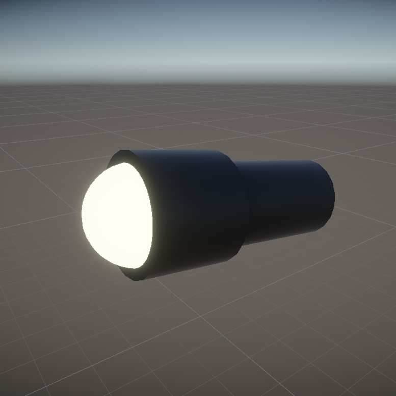
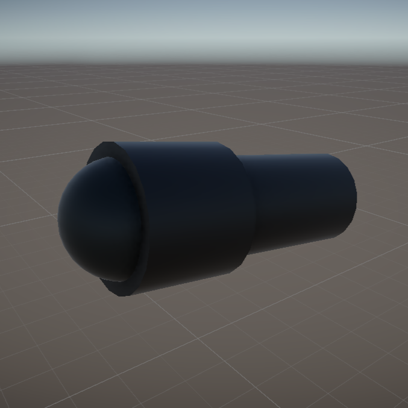
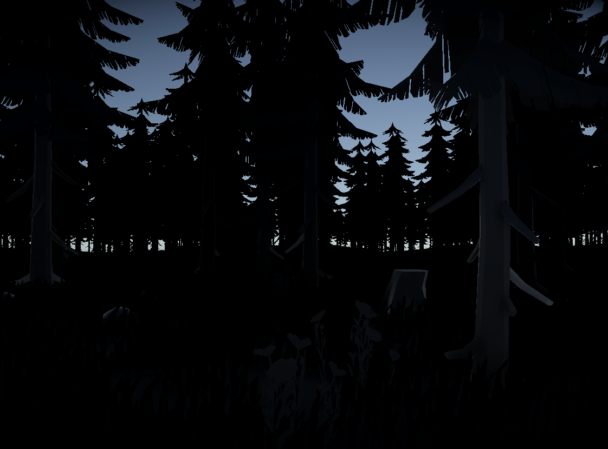
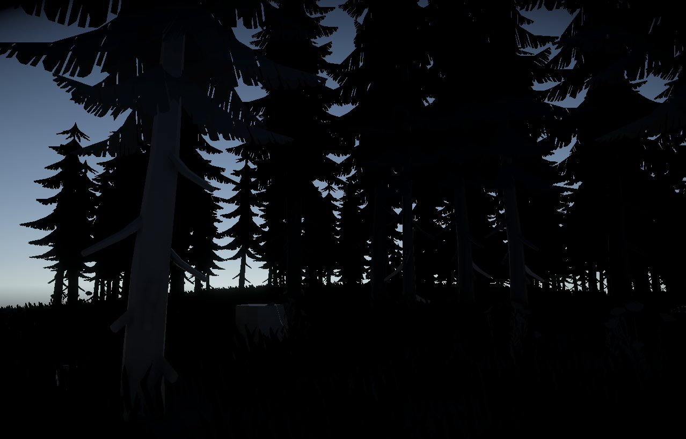
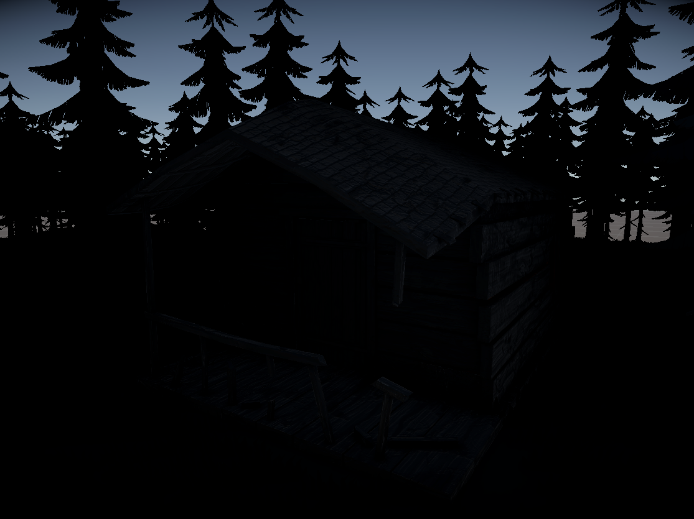
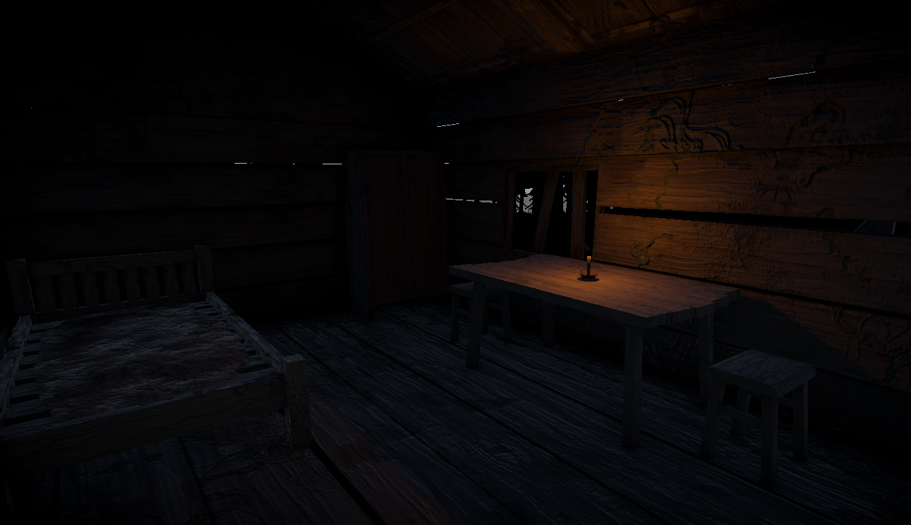
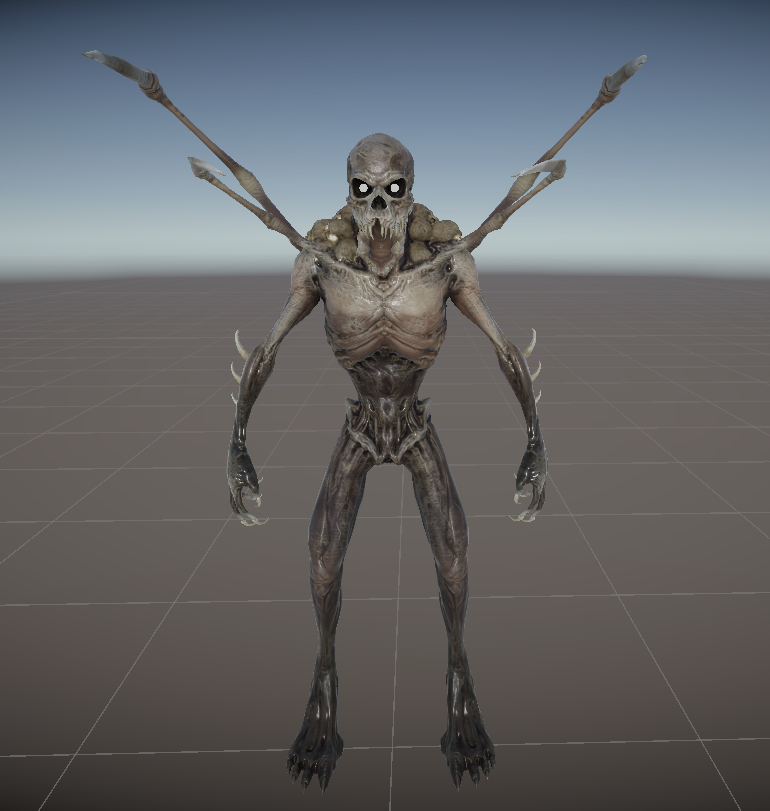

# 03. Grafika

[`Zpět na hlavní přehled (README.md)`](../README.md)

## Vizuální styl

Hra sází na temnou atmosféru nočního lesa. Hlavním zdrojem světla je baterka.

## Vlastní tvorba

**Baterka:** Tento model byl vytvořen přímo v Unity pomocí základních 3D objektů a upravených materiálů.

Model **zapnuté** baterky:

Model **vypnuté** baterky:

## Použíté assety

### Les a prostředí:

**Název:** Low Poly Environment

- [Odkaz na Unity Asset Store](https://assetstore.unity.com/packages/3d/environments/low-poly-environment-nature-free-lowpoly-medieval-fantasy-series-187052)

**Ukázka prostředí:**  
  

### Kabina:

**Název:** Cabin Environment

- [Odkaz na Unity Asset Store](https://assetstore.unity.com/packages/3d/environments/cabin-environment-98014)

**Ukázka kabiny:**  
  

### Monstrum:

**Název:** Monster Mutant

- [Odkaz na Unity Asset Store](https://assetstore.unity.com/packages/3d/characters/creatures/monster-mutant-7-188552)

**Ukázka monstra:**  

