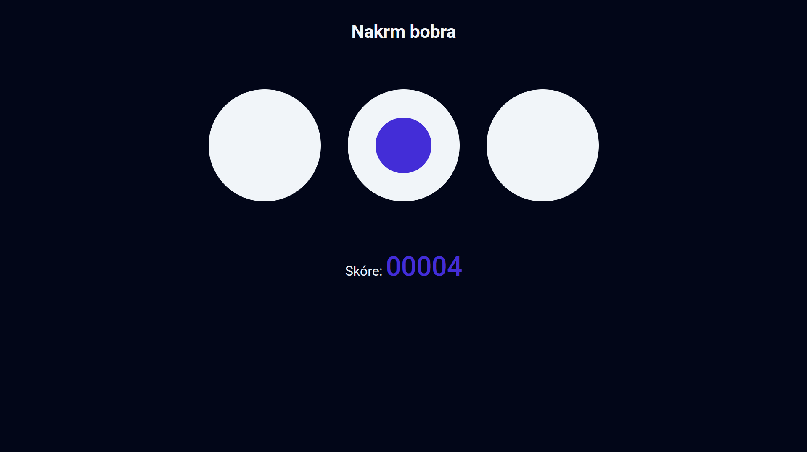

# Web

[⬅️ Zpět na hlavní přehled](../README.md)

## Popis problematiky

Cílem této části bylo vytvořit statickou webovou stránku pro prohlížečovou minihru. Stránka obsahuje 3 nory reprezentované kruhovými vrstvami, ve kterých se v náhodných intervalech objevuje bobr. Pokud uživatel na aktivního bobra stihne kliknout, získá bod, který se přičte do vizuálního počítadla. Počítadlo se resetuje pouze při opětovném načtení stránky

**Použité technologie:**

- HTML
- CSS
- JavaScript

## Ukázka webové stránky



## Klíčové kódy

Rekurzivní funcke v JavaScriptu, která zajišťuje, že se bobr nikdy neobjeví dvakrát po sobě ve stejné noře.

```javascript
function getRandomBeaver(beavers) {
  const index = Math.floor(Math.random() * beavers.length);
  const selectedBeaver = beavers[index];

  if (selectedBeaver === lastHole) {
    return getRandomBeaver(beavers);
  }

  lastHole = selectedBeaver;
  return selectedBeaver;
}
```
