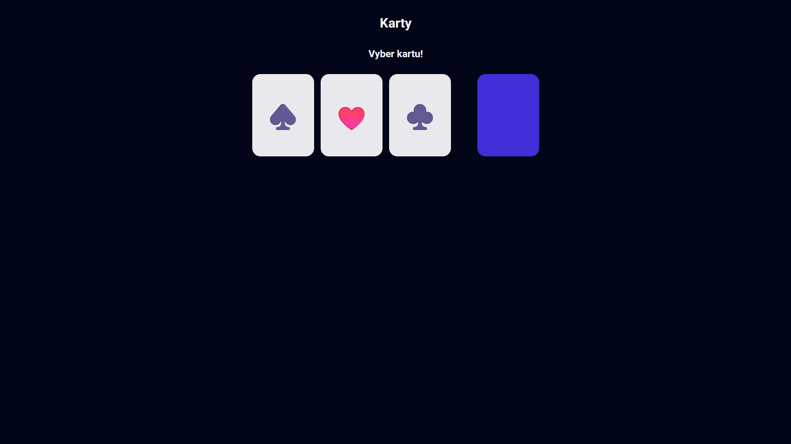
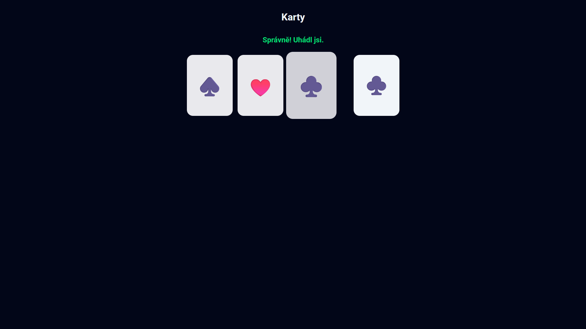
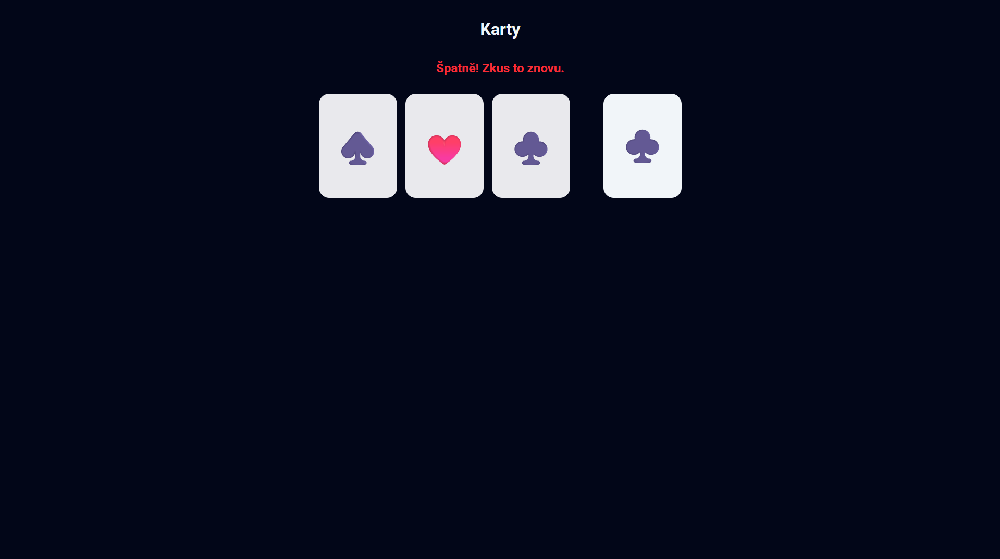

# Web

[⬅️ Zpět na hlavní přehled](../README.md)

## Popis problematiky

Cílem této části bylo vytvořit statickou webovou stránku pro prohlížečovou minihru. Herní plocha obsahuje celkem čtyři karty – tři odhalené se symboly a jednu skrytou (otočenou rubem navrch). Hráč si musí zvolit jednu ze tří odhalených karet. Následně se skrytá karta otočí a textové pole nad hrací plochou hráče informuje, zda byl jeho tip správný, nebo chybný. V případě chyby může hráč hádat znovu v dalším kole.

**Použité technologie:**

- HTML
- CSS
- JavaScript

## Ukázka webové stránky





## Klíčové zdrojové kódy

Následující část kódu řeší hlavní logiku po kliknutí na kartu. Zajišťuje zablokování dalšího klikání během vyhodnocování, odhalení skryté karty, porovnání vybraného symbolu s hádaným symbolem a vypsání odpovídajícího textu s výsledkem. Na konci nastaví časovač pro spuštění nového kola.

```javascript
function handleCardClick(event) {
  if (!isClickable) return;
  isClickable = false;

  const clickedCard = event.currentTarget;
  const clickedSymbol = clickedCard.textContent.trim();

  hiddenCard.style.backgroundColor = "var(--light-clr)";
  hiddenCard.textContent = selectedSymbol;

  if (clickedSymbol === selectedSymbol) {
    resultText.textContent = "Správně! Uhádl jsi.";
    resultText.style.color = "var(--green-clr)";
  } else {
    resultText.textContent = "Špatně! Zkus to znovu.";
    resultText.style.color = "var(--red-clr)";
  }

  setTimeout(startNewRound, 2000);
}
```
