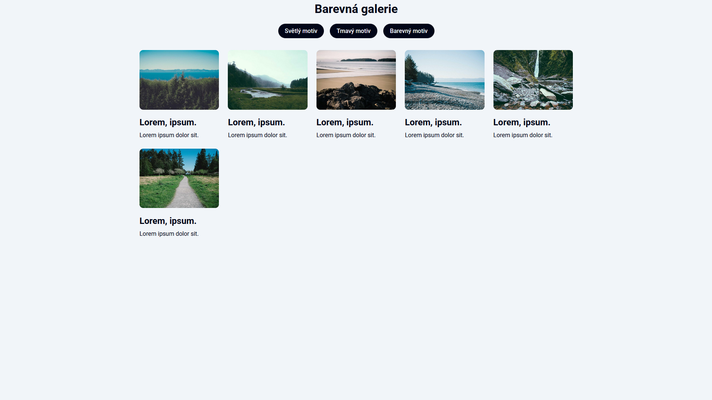
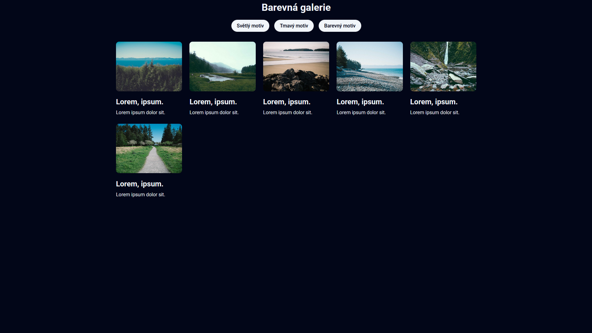
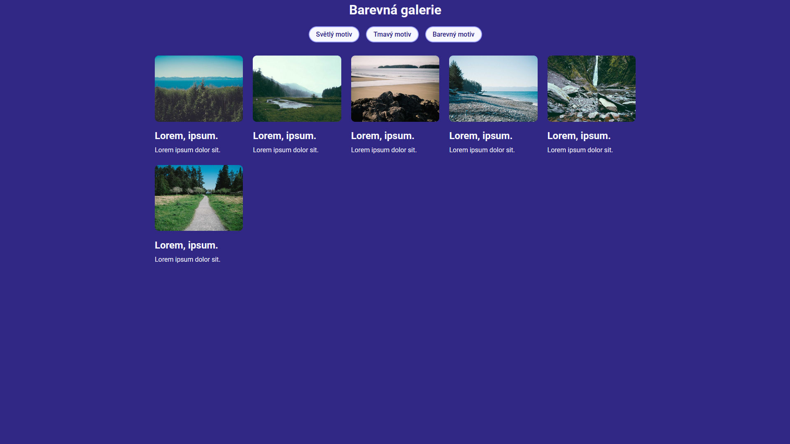

# Web

[⬅️ Zpět na hlavní přehled](../README.md)

## Popis problematiky

Cílem této části práce bylo navrhnout a naprogramovat responzivní statickou webovou stránku pro prezentaci galerie obrázků. Uživatelé mají možnost ovlivňovat celkový vzhled stránky přepínáním mezi třemi předpřipravenými motivy: světlým, tmavým a barevným. Změna motivu je plynulá a projevuje se okamžitě bez nutnosti znovunačítání stránky.

Samotná galerie obsahuje šest obrázků uspořádaných do mřížky. Tyto obrázky lze po kliknutí zvětšit – vybraná fotografie se otevře v plném rozlišení ve vycentrovaném překryvném modálním okně. Okno lze opět snadno zavřít buď pomocí vyhrazeného tlačítka „Zavřít“, nebo intuitivním kliknutím kamkoliv do tmavého prostoru mimo obrázek.

**Použité technologie:**

- HTML
- CSS
- JavaScript

## Ukázka webové stránky





## Klíčové zdrojové kódy

Následující úryvek JavaScriptového kódu zajišťuje logiku pro dynamické přepínání barevných motivů. Nejprve se do konstanty `themeButtons` načtou všechna ovládací tlačítka určená ke změně motivu (pomocí CSS třídy `header__theme--btn`). Kód následně pomocí metody `forEach` prochází jednotlivá tlačítka a přidává jim posluchač události (`EventListener`).

Jakmile uživatel na některé z tlačítek klikne, vyčte se z jeho HTML atributu `data-theme-set` název požadovaného motivu (např. `light` nebo `dark`). Tato hodnota se následně propíše do hlavního kořenového elementu dokumentu do atributu `data-theme`. O samotné překreslení barev na obrazovce se pak automaticky postará CSS pomocí nadefinovaných proměnných.

```javascript
const themeButtons = document.querySelectorAll(".header__theme--btn");

themeButtons.forEach((button) => {
  button.addEventListener("click", (e) => {
    const theme = e.target.getAttribute("data-theme-set");
    document.documentElement.setAttribute("data-theme", theme);
  });
});
```
